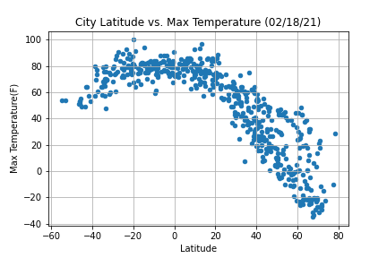
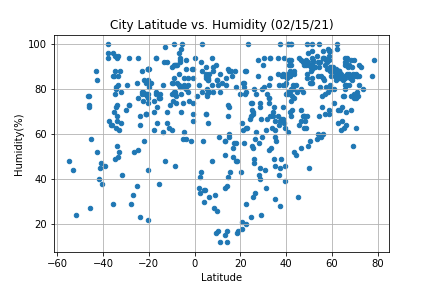
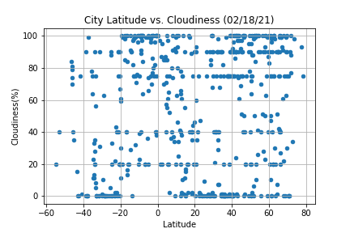
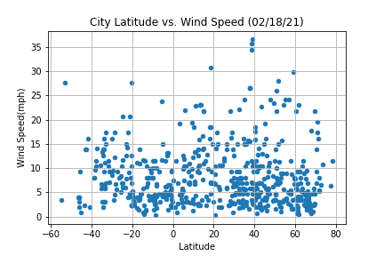
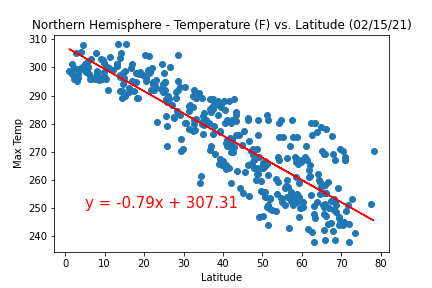
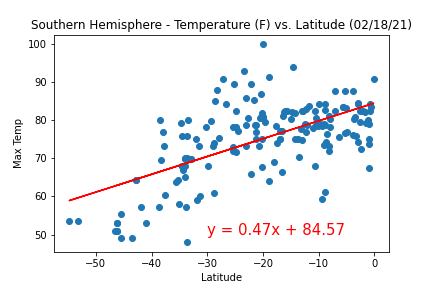
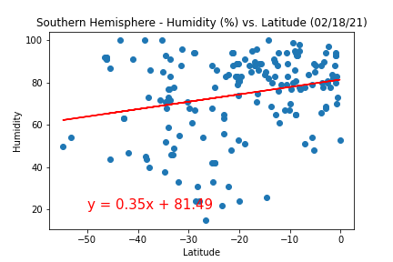
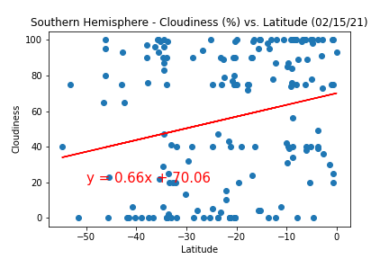
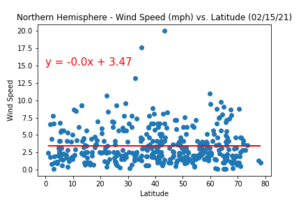
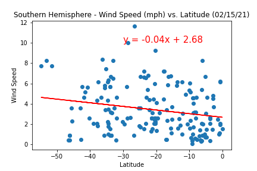

# Python API - What's the Weather Like?

## Part I - WeatherPy

In this part, I created a Python script to visualize the weather of 500+ cities across the world, at varying distances from the equator. 

* Temperature (F) vs. Latitude

* Humidity (%) vs. Latitude

* Cloudiness (%) vs. Latitude

* Wind Speed (mph) vs. Latitude

The second requirement is to run linear regression on each relationship. This time, the plots are separated into Northern Hemisphere (greater than or equal to 0 degrees latitude) and Southern Hemisphere (less than 0 degrees latitude):

* Temperature (F) vs. Latitude - Northern Hemisphere

* Temperature (F) vs. Latitude - Southern Hemisphere

* Humidity (%) vs. Latitude - Northern Hemisphere

* Humidity (%) vs. Latitude - Southern Hemisphere
 

* Cloudiness (%) vs. Latitude - Northern Hemisphere

* Cloudiness (%) vs. Latitude - Southern Hemisphere
 

* Wind Speed (mph) vs. Latitude - Northern Hemisphere

* Wind Speed (mph) vs. Latitude - Southern Hemisphere
 

## Part II - VacationPy

Used jupyter-gmaps and the Google Places API for this part of the assignment.

To complete this part of the assignment, I did the following:

* Created a heat map that displays the humidity for every city from Part I.

* Narrowed down the DataFrame to find ideal weather condition. 

* Used Google Places API to find the first hotel for each city located within 5000 meters of that coordinates.

* Plotted the hotels on top of the humidity heatmap with each pin containing the **Hotel Name**, **City**, and **Country**.

